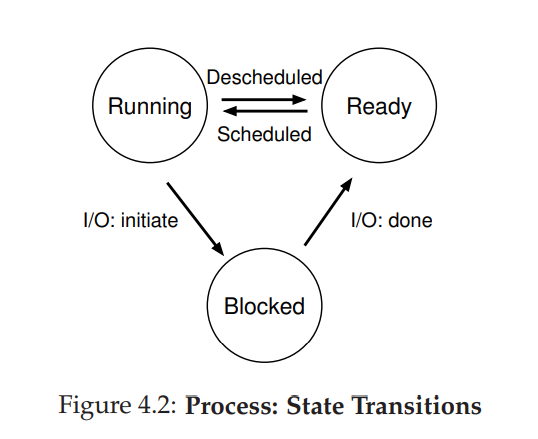

## 抽象：进程(The Abstraction: The Process)

在本章中，我们讨论操作系统为用户提供的最基本的抽象之一： **进程(Process)** 。进程的非官方定义非常简单：它是 **一个正在运行的程序** 。程序本身是没有生命的东西，它只是坐在硬盘上，有一堆指令(也许还有一些静态数据)，等待着行动。操作系统使用这些字节并使其运行，将程序转换为有用的东西。

我们经常要一次运行多个程序。例如，你可能喜欢一边听歌、一边浏览网页、然后还在祖安与队友们嘴臭。实际上，一个典型的系统似乎可能同时运行数十个甚至数百个进程。这样做使系统易于使用，因为永远不用担心CPU是否可用，就这么简单的运行程序。

因此，我们面临的挑战是：

操作系统通过虚拟化CPU来创建这种错觉。通过运行一个进程，然后停止它再运行另一个进程，以此类推，操作系统可能会产生这样的错觉：实际上只有一个(或几个)物理CPU时，存在许多虚拟CPU。这种基本技术称为CPU分时技术，它允许用户允许任意数量的并发进程。潜在的成本就是性能了，因为如果必须共享CPU，则每个处理器的运行速度都会变慢。

为了又快又好的实现CPU虚拟化，操作系统将需要一些底层机器以及一些高层智能。我们称之为 **底层机械机制(low-level machinery mechanisms)** 。 **机制(mechanisms)** 是实现所需功能的低级方法或协议。例如，我们稍后将学习如何实现程序切换，从而使操作系统能够停止运行一个程序并开始在给定的CPU上运行另一个程序；所有现代OS都采用这种分时机制。

这些机制以 **策略** 的形式位于操作系统的某些智能中。 **策略是用于在OS内作出某种决策的算法** 。例如，给定许多可能在CPU上运行的程序，操作系统应该运行哪个程序？OS中的调度策略可能会使用历史信息(例如，哪个程序在最后一分钟运行了更多？)，工作负载(例如，运行什么类型的程序？)和性能指标(例如，系统是否针对互动性能和吞吐量进行了优化？)来做出决定。

## 4.1 抽象：一个进程(The Abstraction: A Process)

我们将正在运行的程序的抽象称为进程。如上所述，一个进程只是一个正在运行的程序；在任何时候，我们都可以通过对它在执行过程中访问或影响的系统不同部分进行清点来总结一个进程。

为了理解什么组成了一个进程，我们首先必须理解其机器状态：程序在运行时可以读取或更新的内容是什么。在任何给定时间，机器的哪些部分对于执行该程序来说至关重要？

构成进程的机器状态中的一个明显组成部分是其 **内存** 。指令位于内存中；正在运行的程序读取和写入的数据也位于内存中。因此，进程可以 **寻址(address)** 的内存(地址空间)是该进程的一部分。

 **寄存器(registers)** 也是该进程的机器状态的一部分。许多指令显式得读取或更新寄存器，因此显然它们对进程的执行很重要。

请注意，构成了机器状态的还有一些特别特殊的寄存器。例如， **程序计数器(program counter)** （有时也称指令指针或IP）告诉我们当前正在执行程序的哪一条指令。类似地， **栈指针(stack pointer)** 和关联的 **栈帧指针(frame pointer)** 用于管理堆栈的函数参数，局部变量和返回地址。

最后，程序也经常访问持久性存储设备。此类I/O信息可能包含进程当前打开的文件列表。

## 4.2 进程API(Process API)

尽管我们将对实际流程API的讨论放到下一章，但在这里我们首先给出一些操作系统的任何接口都必须包含的内容。这些API以某种形式可在任何现代操作系统上使用。

- 创建：操作系统必须包含一些创建新进程的方法。当你在Shell中输入命令或者双击应用程序图标时，将调用操作系统来创建一个新进程来运行指定的程序。
- 销毁：由于存在创建进程的接口，那么系统自然有用于强制销毁进程的接口。当然，许多程序运行完成后自行退出。但是，当他们不退出的时候，用户希望可以 **杀死(Kill)** 它们，因此，销毁通常用于终止失控的进程。
- 等待：有时，等待进程停止运行很有用。因此需要提供某种等待接口。
- 杂项控制：除了终止进程和等待进程外，有时还有其他可能的控制。例如，大多数操作系统提供了某种方法来挂起进程(使其停止运行一段时间)然后恢复它(继续运行)。
- 状态：通常也可以使用接口来获取有关进程的一些状态信息，例如进程运行了多长时间或处于什么状态。

## 4.3 创建进程：一点小细节(Process Creation: A Little More Detail)

我们要揭开一个谜底了，如何将程序转换为进程？更通俗点，操作系统如何启动并运行程序？创建进程应该怎么工作？

OS运行程序必须做的第一件事是将其代码(code)和任何静态数据(static data)(例如初始化变量)加载到内存中，并加载到进程的地址空间中。程序最初以某种可执行格式留在磁盘上(或SSD上)。因此，将程序和静态数据加载到内存的过程要求操作系统从磁盘读取这些字节，并将他们放在内存中的某个位置(如图4.1所示)。

在早期的操作系统中，加载过程快速的完成，也就是在运行程序之前一次完成。现代操作系统就不这么“勤奋”了，仅在程序执行过程中需要时才开始加载代码或数据段。为了真正的理解代码和数据的延迟加载时如何工作的，你必须了解有关 **分页和交换机制(machinery of paging and swapping)** 的更多信息，这是我们将来在讨论内存虚拟化时将涉及的主题。现在，请记住，在运行任何东西之前，操作系统显然必须做一些工作才能将重要的程序位(program bits)从磁盘转移到内存中。

一旦将代码和静态数据加载到内存之后，操作系统在运行该进程之前还需要执行一些其他操作。必须为程序的 **调用栈(run-time stack)** (或栈)分配一些内存。你可能已经知道，C语言程序将栈用于局部变量，函数参数和返回地址。OS分配内存给进程，操作系统也可能会使用参数来初始化栈。具体来说，它将填充 *main()* 函数的参数，即 *argc* 和 *argv* 数组。

操作系统可能还会为程序分配一些内存。在C语言程序中， **堆(heap)** 用于请求动态分配的数据。程序通过调用 *malloc()* 请求此类空间，并通过调用 *free()* 释放该空间。堆是必需的数据结构(例如链表，哈希表，树和其他有趣的数据结构等)，一开始堆会很小。当程序运行并通过 *malloc()* 库API请求更多内存时，操作系统可能会参与其中并为进程分配更多内存，来帮助满足调用。

操作系统还将执行其他一些初始化任务，尤其是输入/输出(I/O)相关的初始化任务。例如，在UNIX系统中，每个进程默认都有三个 **文件描述符(open file descriptors)** ,分别用于标准输入，输出和错误。这些描述符使程序可以轻松地从终端读取输入以及将输出打印到屏幕。我们将在第三部分持久性中学习有关I/O，文件描述符等更多信息。

通过将代码和静态数据加载到内存中，通过创建和初始化堆栈以及进行I/O设置相关的其他工作，OS现在终于为程序执行奠定了基础。因此，它的最后一项任务是：在入口点(main())处运行程序。通过跳到 *main()* 例程(routine)，OS将CPU的控制权转移到新创建的进程上，从而程序开始执行。

## 4.4 进程状态(Process States)

既然我们已经知道了什么是进程，以及如何创建进程。让我们来讨论一下进程在给定时间可能处于的不同状态。在早期计算机中，有一个进程可以处于这些状态之一的观念：

- 正在运行：在运行状态下，进程正在处理器上运行。它正在执行指令。
- 就绪：在就绪状态下，一个进程已经准备好运行了。但是OS因为一些理由而没有让进程运行。
- 阻塞：在阻塞状态下，进程执行了某种操作，使其无法就绪运行，直到发生其他事件为止。例如说：当某个进程向磁盘发起I/O请求时，它会被阻塞，因此某些其他进程可以使用这个处理器。

如果将这些状态映射到图形上，我们将得出4.2中的图。正如你在图中看到的那样，操作系统可以根据需要在就绪状态和运行状态之间移动进程。从就绪状态转为运行状态表示进程 **已安排(scheduled)** ；从运行状态转为就绪状态表示进程 **已调度(descheduled)** 。一旦某个进程被阻塞(例如，通过启动I/O操作)，则OS会将其保持不变，直到发生某些事件(例如,I/O完成)；此时，该进程将再次进入就绪状态(如果操作系统觉得可以的话，可能会立即再次进入运行状态)。

让我们先看两个例子，看看两个进程如何在其中某些状态下过渡。首先，假设有两个正在运行的进程，每个进程仅使用CPU(他们没有I/O)。在这种情况下，每个进程的状态跟踪可能看起来像这个样子：(图4.3)

在下一个示例中，第一个进程在运行一段时间后发出I/O。到那时，该进程会被阻塞，从而使另一个进程有运行的机会。图4.4显示了这种情况。

更具体地说，Process0启动一个I/O并被阻塞，等待它完成。例如，当从硬盘读取或等待来自网络的数据包时，进程会被阻塞。操作系统识别出Process0未使用CPU，并开始运行Process1.当Process1运行时，I/O完成，将Process0移回就绪状态。最后，Process1完成，Process0运行，然后完成。

请注意，即使在这么简单的示例中，操作系统也必须做出很多决策。首先，在Process0启动I/O时，系统必须决定运行Process1。这样做可以通过保持CPU繁忙来提高资源利用率。其次，系统决定在I/O完成后不切换回Process0。目前尚不清楚这是否是一个好的决定。这些类型的决定是由OS调度程序来决定的，我们将在未来的几章里讨论这一主题。

## 4.5  数据结构(Data Structures)

操作系统也是一个程序，并且它像任何程序一样，它具有一些关键数据结构，这些结构可以跟踪各种相关信息。例如，要追踪每个进程的状态，操作系统可能会为所有准备就绪的进程保留某种进程列表，以及一些其他信息以跟踪当前正在运行的进程。当I/O事件完成时，操作系统应确保唤醒正确的进程并准备使其再次运行。

图4.5显示了OS需要跟踪xv6内核中的每个进程的信息类型。类似的进程结构存在于诸如Linux、MacOS X或Windows之类的真实操作系统中。看看它们，有多复杂！

从图中可以看到OS跟踪的有关流程的几个重要信息。对于停止的进程，寄存器的context(实在不知道这个该怎么翻)将保留其寄存器的内容。当进程停止时，其寄存器将保存在该存储位置；通过还原这些寄存器，OS可以恢复运行该进程。在以后的章节中，我们将详细了解这种被称为context switch的技术。

你还可以从图中看到，除了运行、就绪和阻塞外，进程还可以处于其他的一些状态。有时，系统在创建过程时会处于 **初始(initial)** 状态。同意，进程可以置于退出但尚未清除的 **最终(final)** 状态(在基于Unix的系统中，这称为 **僵尸(Zombie)** 状态)。该最终状态很有用，因为它允许其他进程(通常是创建该进程的 **父** 进程) 检查该程序的返回码，并查看刚完成的进程是否成功执行(通常return 0时成功执行，否则为非0)。完成后，父级将进行最后一次调用(例如，*wait()* )以等待子级的完成，并向操作系统指示它可以清除任何与被消除的进程相关的数据结构。

## 4.6 小结(Summary)

我们介绍了操作系统最基本的抽象：进程。它很简单的被视为正在运行的程序。考虑到这种概念上的观点，我们现在将继续研究细节：实现进程所需的底层机制，以及以智能的方式调度它们所需的高级策略。通过组合机制和策略，我们将建立对操作系统如何虚拟化CPU的理解。